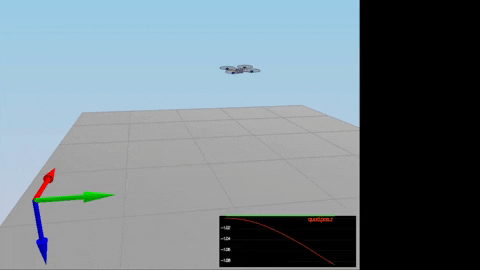
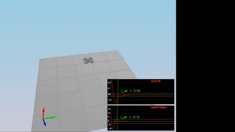
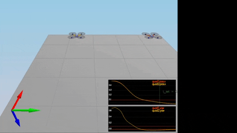
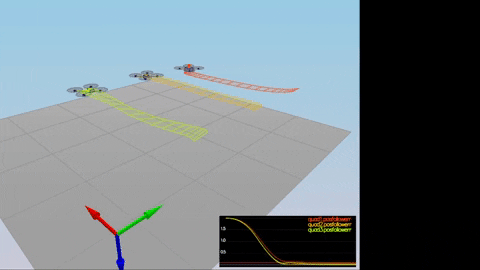
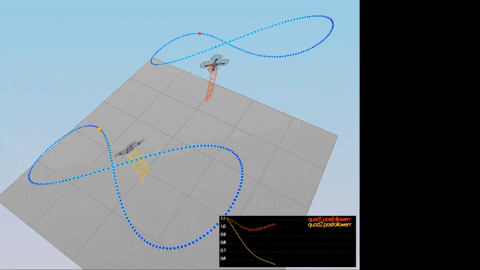

<script type="text/javascript" src="http://cdn.mathjax.org/mathjax/latest/MathJax.js?config=TeX-AMS-MML_HTMLorMML"></script>
<script type="text/x-mathjax-config">
    MathJax.Hub.Config({ tex2jax: {inlineMath: [['$', '$']]}, messageStyle: "none" });
</script>

# Controller Writeup

The following overviews the C++ controller implementation and evaluation.

# Implementation Notes

## Body Rate Control

The controller should be a proportional controller on body rates to commanded moments. The controller should take into account the moments of inertia of the drone when calculating the commanded moments.

The body rate controller is a implemented as a proportional controller, using error between the desired and actual pqr values.   

The tune parameter is the length 3 **kpPQR** vector.

```cpp
    V3F err = pqrCmd - pqr;
    momentCmd = V3F(Ixx, Iyy, Izz) * kpPQR * err;
```

## Roll-Pitch Control

The controller should use the acceleration and thrust commands, in addition to the vehicle attitude to output a body rate command. The controller should account for the non-linear transformation from local accelerations to body rates. Note that the drone's mass should be accounted for when calculating the target angles.

The method returns the target pitch and roll rates of the quadcopter, using the total thrust and desired rotations.  The desired rotations are corrected for min/max tilt values for the quadcopter.  First, it calculates the desired rate of change of the given matrix elements, then converts to angular velocities. 

The tuning parameter is **kpBank** (symmetric quadcopter in x-configuration).

```cpp
    pqrCmd.x = 0.0;
    pqrCmd.y = 0.0;
    pqrCmd.z = 0.0;

    if (collThrustCmd > 0) {
        float c = -collThrustCmd / mass;  // total commanded thrust

        float b_x = CONSTRAIN(accelCmd.x / c, -maxTiltAngle, maxTiltAngle);   
        float b_x_err = b_x - R(0, 2);
        float b_dot_x = kpBank * b_x_err;

        float b_y = CONSTRAIN(accelCmd.y / c, -maxTiltAngle, maxTiltAngle);
        float b_y_err = b_y - R(1, 2);
        float b_dot_y = kpBank * b_y_err;

        pqrCmd.x = (R(1, 0) * b_dot_x - R(0, 0) * b_dot_y) / R(2, 2);
        pqrCmd.y = (R(1, 1) * b_dot_x - R(0, 1) * b_dot_y) / R(2, 2);
  }
```

## Altitude Control

The controller should use both the down position and the down velocity to command thrust. Ensure that the output value is indeed thrust (the drone's mass needs to be accounted for) and that the thrust includes the non-linear effects from non-zero roll/pitch angles.

The altitude controller is a proportional controller that corrects for maximum ascent and descent rates.   Additionally, an integrator is used to correct for bias errors.

Tuning parameters are **kpPosZ**, **kpVelZ**, and **KiPosZ**.

```cpp
    float err = posZCmd - posZ;

    float vel_cmd = CONSTRAIN(velZCmd, -maxAscentRate, maxDescentRate);
    float v_err = vel_cmd - velZ;

    integratedAltitudeError += err * dt;

    float u1_bar = kpPosZ * err + kpVelZ * v_err + KiPosZ * integratedAltitudeError + accelZCmd;

    thrust = -mass*(u1_bar - CONST_GRAVITY) / R(2,2);
```

## Lateral Position Control

The controller uses the local NE position and velocity to generate a commanded local acceleration.  Position and velocity errors are used in the proportional controller.   Velocity and acceleration components are normalized to the max magnitude value (assumes Z-components are 0).    

Tuning parameters are **kpPosXY** and **kpVelXY**.


```cpp
    V3F err = posCmd - pos;

    if (velCmd.mag() > maxSpeedXY) {
        // normalize the velocity components to the max allowed
        velCmd = velCmd.norm() * maxSpeedXY;
    }

    V3F v_err = velCmd - vel;

    accelCmd += kpPosXY * err + kpVelXY * v_err;
    if (accelCmd.mag() > maxAccelXY) {
        // normalize acceleration components to the max allowed
        accelCmd = accelCmd.norm() * maxAccelXY;
    }
```

## Yaw Control

The yaw controller is a proportional heading controller to calculate yaw rate commands.   Desired yaw rate is corrected for values exceeding 2*pi.

The tuning parameter is **kpYaw**.

```cpp
    float yaw_cmd = fmodf(yawCmd, 2 * F_PI);
    float err = yaw_cmd - yaw;
    yawRateCmd = kpYaw * err;
```
## Motor Thrust Control

Based on the default configuration (total thrust == gravity) the mass parameter of the drone was adjusted (from 0.4 to 0.5).

The drone is in an x-configuration - all four rotors contribute to roll and pitch, except with a shorter arm length (by sqrt(2)).

```
    
             x
    rotor_1  ^  rotor_2 
             |
             + - - > y
             
    rotorf_3    rotor_4
    
```
Governing equations become:
```
    | f_tot |    | 1   1   1   1 |   | f_1 |
    | f_p   | =  | 1  -1   1  -1 | * | f_2 |
    | f_q   |    | 1   1  -1  -1 |   | f_3 |
    | f_r   |    |-1   1   1  -1 |   | f_f |
```
inverting and olving for rotor thrusts f_1, f_2, f_3, f_4:

```
                              -1
    | f1 |    | 1   1   1   1 |   | f_tot|
    | f2 | =  | 1  -1   1  -1 | * | f_p  |
    | f3 |    | 1   1  -1  -1 |   | f_q  |
    | f4 |    |-1   1   1  -1 |   | f_r  |
    
```

The implementation for the generating the quad rotor thrusts based on total thrust and requested momentums becomes:

```cpp
    float l = L / sqrtf(2.0f);
    // translate desired moments into forces.
    float f_tot = collThrustCmd;
    float f_p = momentCmd.x / l;
    float f_q = momentCmd.y / l;
    float f_r = momentCmd.z / kappa;

    float f_1 = (f_tot + f_p + f_q - f_r) / 4.0f;   // eqn:  f_tot + f_p + f_q - f_r
    float f_2 = f_1 - (f_p - f_r) / 2.0f;           // eqn:  f_p - f_r
    float f_4 = (f_tot - f_p) / 2.0f - f_2;         // eqn:  f_tot - f_p
    float f_3 = f_tot - f_1 - f_2 - f_4;            // eqn:  f_tot 

    cmd.desiredThrustsN[0] = f_1;
    cmd.desiredThrustsN[1] = f_2;
    cmd.desiredThrustsN[2] = f_3;
    cmd.desiredThrustsN[3] = f_4;
```

Minimum and maximum values of thrust values are limited in QuadDynamics::Dynamics().

# Flight Evaluation

The following scenarios for flight evaluation used the following parameter set for the drone:

```
[QuadControlParams] 

UseIdealEstimator=1

# Physical properties
Mass = 0.5 # 0.495    #  original 0.4
L = 0.17
Ixx = 0.0023
Iyy = 0.0023
Izz = 0.0046
kappa = 0.016
minMotorThrust = .1
maxMotorThrust = 4.5

# Position control gains
kpPosXY = 32 # 1
kpPosZ = 36  # 1

KiPosZ = 20      # 20

# Velocity control gains
kpVelXY = 12 # 4
kpVelZ = 12   # 4

# Angle control gains
kpBank = 12 # 5
kpYaw = 4  # 1

# Angle rate gains
kpPQR = 88, 88, 8 # 23, 23, 5

# limits
maxAscentRate = 5
maxDescentRate = 2
maxSpeedXY = 5
maxHorizAccel = 12
maxTiltAngle = .7
```

Proportional gains maximized to reduce tracking error.   The derivative gains were adjusted to reduce dampening in the response.

## Scenario 1

<p style="text-align:center">

</p>

```
SIMULATOR!
Select main window to interact with keyboard/mouse:
LEFT DRAG / X+LEFT DRAG / Z+LEFT DRAG = rotate, pan, zoom camera
W/S/UP/LEFT/DOWN/RIGHT - apply force
C - clear all graphs
R - reset simulation
Space - pause simulation
Simulation #1 (../config/1_Intro.txt)
Simulation #2 (../config/1_Intro.txt)
PASS: ABS(Quad.PosFollowErr) was less than 0.500000 for at least 0.800000 seconds
Simulation #3 (../config/1_Intro.txt)
PASS: ABS(Quad.PosFollowErr) was less than 0.500000 for at least 0.800000 seconds
Simulation #4 (../config/1_Intro.txt)
PASS: ABS(Quad.PosFollowErr) was less than 0.500000 for at least 0.800000 seconds
Simulation #5 (../config/1_Intro.txt)
```

## Scenario 2


<p style="text-align:center">

</p>

```
SIMULATOR!
Select main window to interact with keyboard/mouse:
LEFT DRAG / X+LEFT DRAG / Z+LEFT DRAG = rotate, pan, zoom camera
W/S/UP/LEFT/DOWN/RIGHT - apply force
C - clear all graphs
R - reset simulation
Space - pause simulation
Simulation #1 (../config/2_AttitudeControl.txt)
Simulation #2 (../config/2_AttitudeControl.txt)
PASS: ABS(Quad.Roll) was less than 0.025000 for at least 0.750000 seconds
PASS: ABS(Quad.Omega.X) was less than 2.500000 for at least 0.750000 seconds
Simulation #3 (../config/2_AttitudeControl.txt)
PASS: ABS(Quad.Roll) was less than 0.025000 for at least 0.750000 seconds
PASS: ABS(Quad.Omega.X) was less than 2.500000 for at least 0.750000 seconds
Simulation #4 (../config/2_AttitudeControl.txt)
```

## Scenario 3


<p style="text-align:center">

</p>

```
SIMULATOR!
Select main window to interact with keyboard/mouse:
LEFT DRAG / X+LEFT DRAG / Z+LEFT DRAG = rotate, pan, zoom camera
W/S/UP/LEFT/DOWN/RIGHT - apply force
C - clear all graphs
R - reset simulation
Space - pause simulation
Simulation #1 (../config/3_PositionControl.txt)
Simulation #2 (../config/3_PositionControl.txt)
PASS: ABS(Quad1.Pos.X) was less than 0.100000 for at least 1.250000 seconds
PASS: ABS(Quad2.Pos.X) was less than 0.100000 for at least 1.250000 seconds
PASS: ABS(Quad2.Yaw) was less than 0.100000 for at least 1.000000 seconds
Simulation #3 (../config/3_PositionControl.txt)
PASS: ABS(Quad1.Pos.X) was less than 0.100000 for at least 1.250000 seconds
PASS: ABS(Quad2.Pos.X) was less than 0.100000 for at least 1.250000 seconds
PASS: ABS(Quad2.Yaw) was less than 0.100000 for at least 1.000000 seconds
Simulation #4 (../config/3_PositionControl.txt)
```

## Scenario 4


<p style="text-align:center">

</p>

```
SIMULATOR!
Select main window to interact with keyboard/mouse:
LEFT DRAG / X+LEFT DRAG / Z+LEFT DRAG = rotate, pan, zoom camera
W/S/UP/LEFT/DOWN/RIGHT - apply force
C - clear all graphs
R - reset simulation
Space - pause simulation
Simulation #1 (../config/4_Nonidealities.txt)
Simulation #2 (../config/4_Nonidealities.txt)
PASS: ABS(Quad1.PosFollowErr) was less than 0.100000 for at least 1.500000 seconds
PASS: ABS(Quad2.PosFollowErr) was less than 0.100000 for at least 1.500000 seconds
PASS: ABS(Quad3.PosFollowErr) was less than 0.100000 for at least 1.500000 seconds
Simulation #3 (../config/4_Nonidealities.txt)
PASS: ABS(Quad1.PosFollowErr) was less than 0.100000 for at least 1.500000 seconds
PASS: ABS(Quad2.PosFollowErr) was less than 0.100000 for at least 1.500000 seconds
PASS: ABS(Quad3.PosFollowErr) was less than 0.100000 for at least 1.500000 seconds
Simulation #4 (../config/4_Nonidealities.txt)
```

## Scenario 5

The quad2, which incorporates velocities in its trajectory (via traj/FigureEightFF.txt), comes within tolerances.

<p style="text-align:center">

</p>

````
SIMULATOR!
Select main window to interact with keyboard/mouse:
LEFT DRAG / X+LEFT DRAG / Z+LEFT DRAG = rotate, pan, zoom camera
W/S/UP/LEFT/DOWN/RIGHT - apply force
C - clear all graphs
R - reset simulation
Space - pause simulation
Simulation #1 (../config/5_TrajectoryFollow.txt)
Simulation #2 (../config/5_TrajectoryFollow.txt)
PASS: ABS(Quad2.PosFollowErr) was less than 0.250000 for at least 3.000000 seconds
Simulation #3 (../config/5_TrajectoryFollow.txt)
PASS: ABS(Quad2.PosFollowErr) was less than 0.250000 for at least 3.000000 seconds
Simulation #4 (../config/5_TrajectoryFollow.txt)
```

<script type="text/javascript" src="http://cdn.mathjax.org/mathjax/latest/MathJax.js?config=TeX-AMS-MML_HTMLorMML"></script>
<script type="text/x-mathjax-config"> MathJax.Hub.Config({ tex2jax: {inlineMath: [['$', '$']]}, messageStyle: "none" });</script>